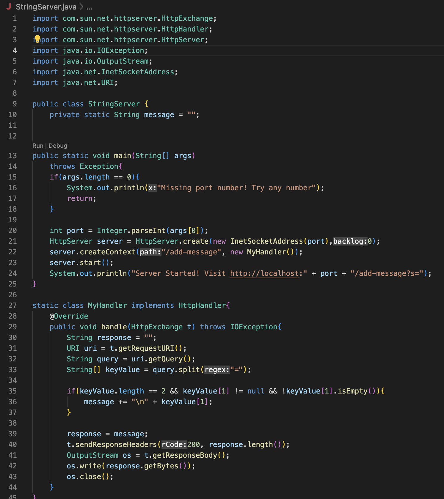

# String Server

-String Server code:

-StringServer First Output:

- Method `handle`is called(in the class `MyHandler`)
- The values of the class fields are:
  * `HttpExchange t = localhost:17/add-message?s=hello`
  * `URI uri = add-message?s=hello` took the path from `localhost:27/add-message?s=hello`
  * `String query = s=hello` query from `add-message?s=hello`
  * `String[] keyValue = keyValue[0] = s, keyValue[1] = hello` -seperated `s` from `hello`
  * `message = hello -returned \n + keyValue[1]`
  * `response = hello` -copied the value of `message` into `response`

-StringServer Second Output:

- Method `handle`is called(in the class `MyHandler`)
- The values of the class fields are:
  * `HttpExchange t = localhost:17/add-message?s=how are you?`
  * `URI uri = add-message?s=how are you?` took the path from `localhost:27/add-message?s=how are you?`
  * `String query = s=how are you?` query from `add-message?s=how are you?`
  * `String[] keyValue = keyValue[0] = s, keyValue[1] = how are you?` -seperated `s` from `how are you?`
  * `message = hello -\nhow are yo?` added as well `\n + keyValue[1]` to `hello`
  * `response = hello \nhow are you?` copied the value of `message` to `repsonse`
