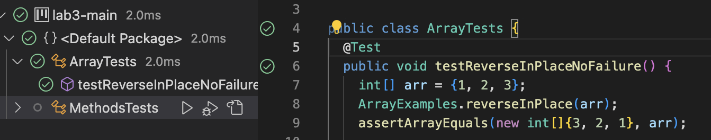

# Part 1

-String Server code:


-StringServer First Output:


- Method `handle`is called(in the class `MyHandler`)
- The values of the class fields are:
  * `HttpExchange t = localhost:17/add-message?s=hello`
  * `URI uri = add-message?s=hello` took the path from `localhost:27/add-message?s=hello`
  * `String query = s=hello` query from `add-message?s=hello`
  * `String[] keyValue = keyValue[0] = s, keyValue[1] = hello` -seperated `s` from `hello`
  * `message = hello -returned \n + keyValue[1]`
  * `response = hello` -copied the value of `message` into `response`


-StringServer Second Output:


- Method `handle`is called(in the class `MyHandler`)
- The values of the class fields are:
  * `HttpExchange t = localhost:17/add-message?s=how are you?`
  * `URI uri = add-message?s=how are you?` took the path from `localhost:27/add-message?s=how are you?`
  * `String query = s=how are you?` query from `add-message?s=how are you?`
  * `String[] keyValue = keyValue[0] = s, keyValue[1] = how are you?` -seperated `s` from `how are you?`
  * `message = hello -\nhow are yo?` added as well `\n + keyValue[1]` to `hello`
  * `response = hello \nhow are you?` copied the value of `message` to `repsonse`
  
  
  # Part 2

-The bug I will be going through from this lab is from the method reverseInPlace(int[] arr).The given method reverseInPlace takes 
an array of integers arr as input and modifies the input array by reversing its elements in place.

-Failure-inducing input:
```
public void testReverseInPlaceFailure() {
    int[] arr = {1, 2, 3, 4, 5};
    reverseInPlace(arr);
    assertArrayEquals(new int[]{5, 4, 3, 2, 1}, arr);
}
```

-Non-failure input:
```
public void testReverseInPlaceNoFailure() {
    int[] arr = {1, 2, 3};
    reverseInPlace(arr);
    assertArrayEquals(new int[]{3, 2, 1}, arr);
}
```

-Failure-inducing output:

The approach does not swap the elements correctly as it overwrites the original values of the array with the swapped values, which then results in the elements of the array becoming the same as the last element.

-Non-failure output

Here the non-failure input correctly passes the tester.

Bug fix:
  
  -Original code:
 ```
 static void reverseInPlace(int[] arr) {
    for(int i = 0; i < arr.length; i += 1) {
      arr[i] = arr[arr.length - i - 1];
    }
  ```
  
  -Fixed Code:
  
  This implementation correctly swaps the first and last elements, then moves inward by one element and keeps swapping again. The for loop iterates over only half the length since the second half of the array would already be swapped out.
  ```
  static void reverseInPlace(int[] arr) {
    for(int i = 0; i < arr.length / 2; i += 1) {
        int temp = arr[i];
        arr[i] = arr[arr.length - i - 1];
        arr[arr.length - i - 1] = temp;
    }
}
```

# Part 3

One thing I learned from lab in week 2/3 was changing the though process on finding bugs. Before I would just randomly change my code and see if it would work. But after reading the lecture articles and going through the lab steps I was able to gain a new mindset where I have a much more clear thought process with lookiing through the code for a bug that was messing up my program.
